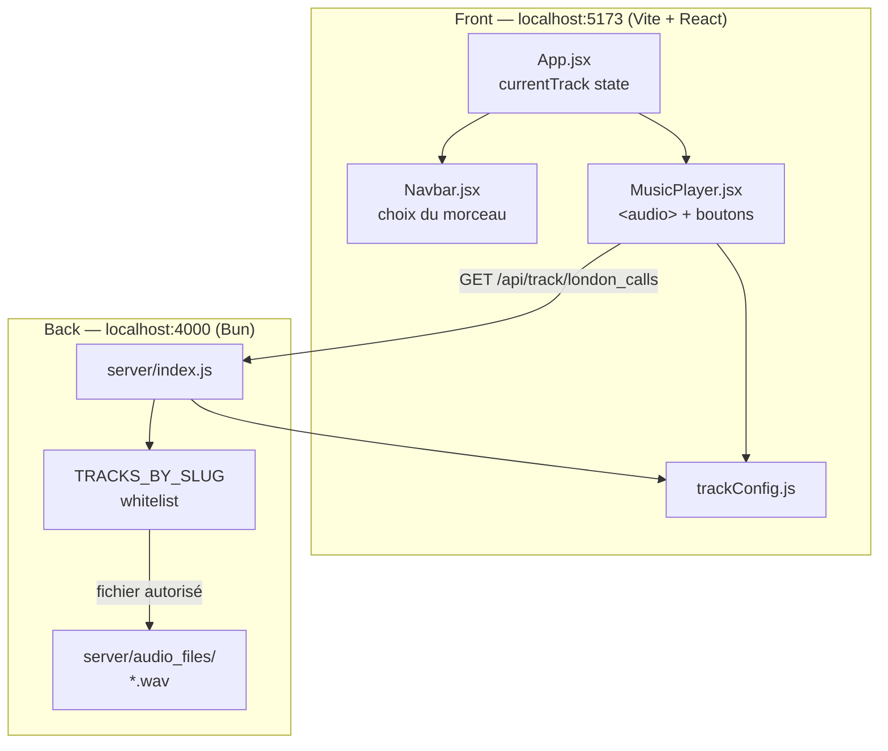
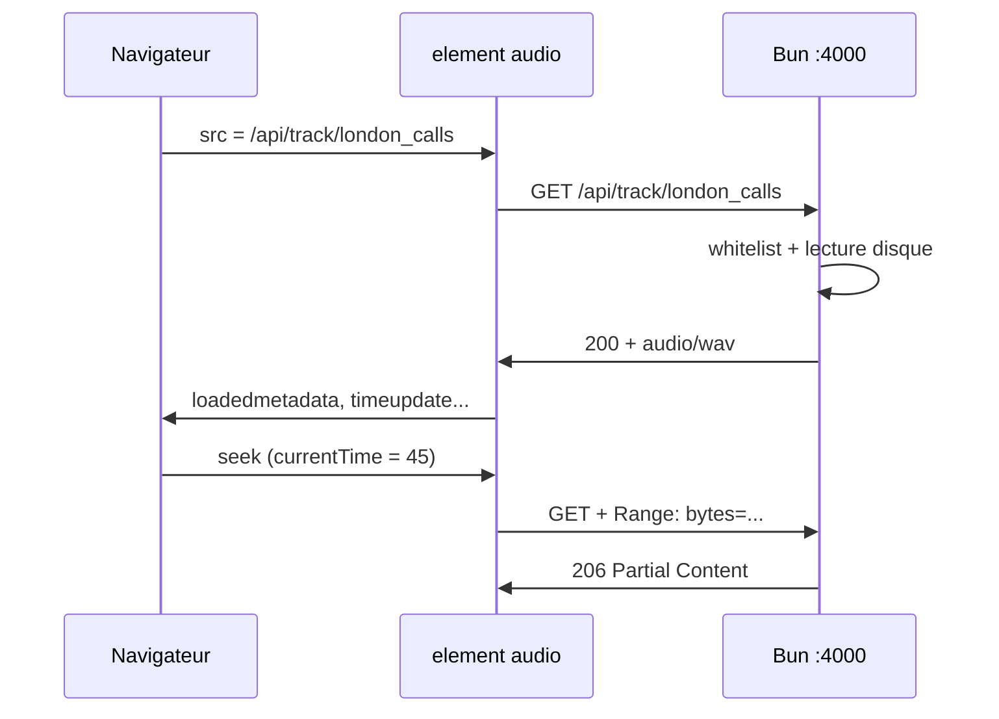

# Lecteur audio React + serveur Bun

> Notes d'apprentissage pour Obsidian — lecture ligne par ligne, architecture, et procédure reproductible.
> Contexte : tu maîtrises le front (HTML/CSS/React de base) mais le back-end te semble opaque. Ce document comble ce trou.

---

## Table des matières

1. [[#1. Vue d'ensemble — ce qu'on a construit]]
2. [[#2. Vocabulaire back-end (mini dictionnaire)]]
3. [[#3. Architecture globale]]
4. [[#4. Fichier trackConfig.js — ligne par ligne]]
5. [[#5. Serveur Bun — index.js ligne par ligne]]
6. [[#6. MusicPlayer.jsx — ligne par ligne]]
7. [[#7. App.jsx — le state partagé]]
8. [[#8. Flux complet d'une lecture]]
9. [[#9. Procédure pour reproduire sur un autre projet]]
10. [[#10. Débogage]]
11. [[#11. Limites et prochaines étapes]]

---

## 1. Vue d'ensemble — ce qu'on a construit

### Problème initial

- Les boutons du lecteur (play, skip, barre) étaient **déconnectés** : pas de `onClick`, pas de logique.
- L'audio pointait vers un chemin local `../../server/audio_files/...` que le navigateur **ne peut pas servir** correctement.
- Les fichiers audio seraient **accessibles à n'importe qui** si on les mettait dans le dossier `public/` de Vite.

### Solution

| Brique | Rôle |
|--------|------|
| `data/trackConfig.js` | Liste officielle des morceaux (slug, titre, fichier) |
| `server/index.js` | Mini serveur Bun qui ne sert **que** les fichiers autorisés |
| `MusicPlayer.jsx` | Interface + élément `<audio>` + state React |
| `App.jsx` | State `currentTrack` partagé entre Navbar et lecteur |

### Résultat utilisateur

- Play / Pause
- Morceau précédent / suivant (avec boucle)
- Barre de progression + seek au clic
- Temps écoulé / durée totale
- Fin de morceau → passage auto au suivant
- Seuls les morceaux avec fichier réel peuvent être lus

---

## 2. Vocabulaire back-end (mini dictionnaire)

Tu n'as pas besoin de tout maîtriser. Retiens ces mots :

| Terme | Signification simple | Analogie |
|-------|---------------------|----------|
| **Serveur** | Programme qui écoute des requêtes réseau et répond | Guichetier : tu demandes, il te donne (ou refuse) |
| **Port** | Numéro de « ligne téléphonique » (`4000`) | Extension interne du bâtiment |
| **Route** | Chemin URL géré (`/api/track/london_calls`) | « Si tu demandes cette porte, voici la procédure » |
| **Requête (request)** | Ce que le navigateur envoie (GET, headers…) | Ta commande au guichet |
| **Réponse (response)** | Ce que le serveur renvoie (status, body, headers) | Le colis + le bon de livraison |
| **Whitelist** | Liste fermée de ce qui est autorisé | Liste VIP : pas sur la liste = pas d'entrée |
| **CORS** | Règle de sécurité entre deux origines (ports/domaines différents) | Le videur vérifie que tu viens du bon club |
| **Header** | Métadonnée HTTP (`Content-Type`, `Range`…) | Étiquette sur le colis |
| **Status 200** | OK | Livraison réussie |
| **Status 404** | Introuvable | « On n'a pas ça » |
| **Status 206** | Contenu partiel (Range) | Livraison d'un morceau du colis |
| **API** | Interface HTTP pour échanger des données | Menu du restaurant : tu commandes par numéro |

---

## 3. Architecture globale



### Pourquoi deux programmes séparés ?

- **Vite** (port 5173) : compile React, hot reload, UI.
- **Bun** (port 4000) : sert les fichiers audio avec des règles.

En dev, ce sont **deux origines** différentes → d'où le CORS.

### Pourquoi pas tout dans React ?

React tourne **dans le navigateur**. Le navigateur ne peut pas lire directement ton disque dur (`server/audio_files/`). Il faut un intermédiaire qui :
1. lit le fichier sur le disque ;
2. l'envoie via HTTP au navigateur.

Cet intermédiaire = le serveur Bun.

---

## 4. Fichier `data/trackConfig.js` — ligne par ligne

Ce fichier est la **source de vérité** partagée front + back.

```js
export const TRACK_LIST = [
  { slug: 'vertigo', title: 'Vertigo', fileName: null },
  // ...
];
```

| Ligne / propriété | Explication | Pourquoi |
|-------------------|-------------|----------|
| `export const` | Rend la variable importable ailleurs | Évite la duplication front/back |
| `slug` | Identifiant court URL-safe (`london_calls`) | Les URLs n'aiment pas les espaces ni les parenthèses |
| `title` | Nom affiché (`London Calls (Interlude)`) | Correspond à `artistData.json` et la Navbar |
| `fileName: null` | Pas de fichier sur le disque | Le morceau apparaît dans l'UI mais ne peut pas jouer |
| `fileName: 'LondonCallsInterlude.wav'` | Nom exact du fichier | Le serveur concatène avec le dossier `audio_files/` |

```js
export const TRACKS_BY_SLUG = Object.fromEntries(
  TRACK_LIST.filter((track) => track.fileName).map((track) => [
    track.slug,
    track.fileName,
  ]),
);
```

**Réflexion étape par étape :**

1. `.filter((track) => track.fileName)` → garde uniquement les morceaux qui ont un vrai fichier.
2. `.map(...)` → transforme en paires `[slug, fileName]`.
3. `Object.fromEntries(...)` → convertit en objet :

```js
{
  bad_news: 'BadNewsIKill ThePresident.wav',
  london_calls: 'LondonCallsInterlude.wav'
}
```

**Pourquoi un objet séparé ?** Le serveur n'a besoin **que** de cette map. Pas de `null`, pas de titres : juste « slug → fichier ».

```js
export const AUDIO_API_URL = 'http://localhost:4000';
```

URL de base du serveur Bun en développement.

```js
export function titleToSlug(titleOrSlug) {
  const track = TRACK_LIST.find(
    (t) => t.title === titleOrSlug || t.slug === titleOrSlug,
  );
  return track?.slug ?? null;
}
```

| Partie | Rôle |
|--------|------|
| `.find(...)` | Cherche le morceau dans la liste |
| `t.title === titleOrSlug \|\| t.slug === titleOrSlug` | Accepte titre OU slug (tolérance) |
| `track?.slug` | Optional chaining : si pas trouvé → `undefined` |
| `?? null` | Nullish coalescing : renvoie `null` si undefined |

**Pourquoi cette fonction ?** `App` et `Navbar` utilisent le **titre** (`London Calls (Interlude)`). L'API utilise le **slug** (`london_calls`). C'est le pont entre les deux.

```js
export function getAudioUrl(slug) {
  return `${AUDIO_API_URL}/api/track/${slug}`;
}
```

Template string → `http://localhost:4000/api/track/london_calls`

C'est l'URL que l'élément `<audio>` va charger.

```js
export function getTrackIndex(titleOrSlug) {
  const slug = titleToSlug(titleOrSlug);
  return TRACK_LIST.findIndex((t) => t.slug === slug);
}
```

Retourne la position dans la playlist (0, 1, 2…) pour skip prev/next.

---

## 5. Serveur Bun — `server/index.js` ligne par ligne

### Imports et constantes

```js
import { TRACKS_BY_SLUG } from '../data/trackConfig.js';
```

Le serveur **réutilise** la whitelist du front. Une modification = les deux restent sync.

```js
const PORT = 4000;
const ALLOWED_ORIGIN = 'http://localhost:5173';
```

| Constante | Pourquoi |
|-----------|----------|
| `PORT` | Vite utilise 5173, le serveur audio 4000 → pas de conflit |
| `ALLOWED_ORIGIN` | Seul ce front peut lire l'audio (CORS) |

```js
const AUDIO_DIR = new URL('./audio_files/', import.meta.url).pathname;
```

**Réflexion :** `import.meta.url` = URL du fichier `index.js` actuel.  
`new URL('./audio_files/', ...)` = chemin relatif vers le dossier audio.  
`.pathname` = chemin absolu sur le disque.

**Pourquoi pas `'./audio_files/'` en dur ?** Ça dépend d'où tu lances la commande. Cette méthode est **fiable** peu importe le cwd.

### Fonctions utilitaires

```js
function getMimeType(fileName) {
  const ext = fileName.slice(fileName.lastIndexOf('.')).toLowerCase();
  return MIME_TYPES[ext] ?? 'application/octet-stream';
}
```

Le navigateur a besoin de savoir **quel type de fichier** il reçoit (`.wav` → `audio/wav`). Sinon il peut refuser de le lire.

```js
function corsHeaders(extra = {}) {
  return {
    'Access-Control-Allow-Origin': ALLOWED_ORIGIN,
    ...extra,
  };
}
```

`...extra` = spread : fusionne les headers CORS avec d'autres headers (Content-Type, etc.).

### Démarrage du serveur

```js
const server = Bun.serve({
  port: PORT,
  async fetch(req) { /* ... */ },
});
```

| Partie | Signification |
|--------|---------------|
| `Bun.serve` | API Bun pour créer un serveur HTTP |
| `async fetch(req)` | Fonction appelée à **chaque** requête entrante |
| `req` | Objet Request (URL, method, headers…) |

### Gestion OPTIONS (preflight CORS)

```js
if (req.method === 'OPTIONS') {
  return new Response(null, { status: 204, headers: corsHeaders({...}) });
}
```

Parfois le navigateur envoie une requête « test » avant la vraie. On répond « OK, tu peux continuer » avec status **204 No Content**.

### Route principale `/api/track/:id`

```js
if (url.pathname.startsWith('/api/track/')) {
  const id = url.pathname.replace('/api/track/', '');
```

Extrait le slug de l'URL. Ex : `/api/track/london_calls` → `london_calls`.

```js
  if (!/^[a-z0-9_]+$/.test(id)) {
    return new Response('Invalid track id', { status: 400 });
  }
```

**Sécurité minimale — regex :**

- Autorise : lettres minuscules, chiffres, underscore.
- Refuse : `../`, `/`, `%`, espaces…

**Pourquoi ?** Sans ça, un attaquant pourrait tenter `../../../etc/passwd`. Ici, la regex bloque avant même d'aller au disque.

```js
  const fileName = TRACKS_BY_SLUG[id];
  if (!fileName) {
    return new Response('Track not found', { status: 404 });
  }
```

**Whitelist :** si le slug n'est pas dans l'objet → 404. Même si un fichier existe sur le disque avec un nom random, il n'est **pas** servi.

```js
  const file = Bun.file(filePath);
  const exists = await file.exists();
```

`Bun.file` = abstraction pour lire un fichier. `.exists()` vérifie qu'il est là (évite une erreur 500).

### Support du header Range (seek)

```js
const range = req.headers.get('range');

if (range) {
  const parts = range.replace(/bytes=/, '').split('-');
  const start = parseInt(parts[0], 10);
  const end = parts[1] ? parseInt(parts[1], 10) : fileSize - 1;
```

Exemple de header navigateur : `Range: bytes=1000-2000`

**Pourquoi c'est crucial ?**

- La barre de progression (seek) demande « envoie-moi à partir de la seconde X ».
- Sans Range, le serveur renverrait tout le fichier depuis le début à chaque seek → lent et cassé.

```js
  return new Response(file.slice(start, end + 1), {
    status: 206,
    headers: corsHeaders({
      'Content-Range': `bytes ${start}-${end}/${fileSize}`,
      'Accept-Ranges': 'bytes',
      ...
    }),
  });
```

| Status | Signification |
|--------|---------------|
| **206** | Partial Content — morceau du fichier |
| **Content-Range** | « Voici les octets 1000-2000 sur un total de 17 000 000 » |

### Réponse complète (sans Range)

```js
return new Response(file, {
  status: 200,
  headers: corsHeaders({
    'Content-Length': String(fileSize),
    'Accept-Ranges': 'bytes',
    'Content-Type': contentType,
  }),
});
```

Première lecture : le navigateur peut télécharger tout le fichier ou commencer à streamer.

---

## 6. `MusicPlayer.jsx` — ligne par ligne

### Imports

```js
import { useRef, useState, useEffect, useCallback } from 'react';
```

| Hook | Rôle dans ce composant |
|------|------------------------|
| `useRef` | Référence permanente à l'élément `<audio>` DOM |
| `useState` | State React pour l'UI (isPlaying, temps…) |
| `useEffect` | Effets de bord (changer src, écouter événements) |
| `useCallback` | Mémorise une fonction pour éviter re-renders inutiles |

**Pourquoi `useRef` pour `<audio>` ?**  
React gère le virtual DOM. Pour appeler `.play()` ou `.pause()`, tu as besoin de l'**élément DOM réel**. `audioRef.current` pointe dessus.

### `formatTime(seconds)`

```js
function formatTime(seconds) {
  if (!Number.isFinite(seconds) || seconds < 0) return '0:00';
  const minutes = Math.floor(seconds / 60);
  const secs = Math.floor(seconds % 60);
  return `${minutes}:${secs.toString().padStart(2, '0')}`;
}
```

| Ligne | Pourquoi |
|-------|----------|
| `Number.isFinite` | Au chargement, `duration` peut être `NaN` |
| `Math.floor(seconds / 60)` | Minutes entières |
| `seconds % 60` | Secondes restantes |
| `padStart(2, '0')` | `5` → `05` pour un affichage `1:05` |

### State et valeurs dérivées

```js
const audioRef = useRef(null);
const [isPlaying, setIsPlaying] = useState(false);
const [currentTime, setCurrentTime] = useState(0);
const [duration, setDuration] = useState(0);
```

**Double state (React + navigateur) :**

- Le **navigateur** sait où en est la lecture (`audio.currentTime`).
- **React** copie ces valeurs pour afficher la barre et le texte.

```js
const currentSlug = titleToSlug(currentTrack);
const hasAudio = currentSlug && TRACKS_BY_SLUG[currentSlug];
const progress = duration > 0 ? (currentTime / duration) * 100 : 0;
```

| Variable | Type | Rôle |
|----------|------|------|
| `currentSlug` | dérivée | Convertit le titre Navbar → slug API |
| `hasAudio` | dérivée | `true` seulement si fichier existe |
| `progress` | dérivée | Pourcentage 0-100 pour la barre |

**Pas de `useState` pour `progress`** → recalculé à chaque render quand `currentTime` change. C'est voulu : moins de state = moins de bugs.

### `play()` et `pause()`

```js
const play = useCallback(async () => {
  const audio = audioRef.current;
  if (!audio || !hasAudio) return;
  try {
    await audio.play();
    setIsPlaying(true);
  } catch (err) {
    console.warn('Lecture bloquée par le navigateur :', err);
    setIsPlaying(false);
  }
}, [hasAudio]);
```

| Partie | Explication |
|--------|-------------|
| `useCallback` | Recrée la fonction seulement si `hasAudio` change |
| `audio.play()` | API native — renvoie une **Promise** |
| `await` | Attend que la lecture démarre (ou échoue) |
| `try/catch` | Les navigateurs **bloquent l'autoplay** sans interaction utilisateur |

```js
const pause = useCallback(() => {
  audio.pause();
  setIsPlaying(false);
}, []);
```

Plus simple : pas de Promise, pas d'autoplay policy.

### `togglePlayPause()`

```js
const togglePlayPause = () => {
  isPlaying ? pause() : play();
};
```

Fonction **non** mémorisée : recréée à chaque render, mais c'est OK pour un simple onClick.

### `goToTrack(direction)`

```js
const nextIndex =
  direction === 'next'
    ? (index + 1) % TRACK_LIST.length
    : (index - 1 + TRACK_LIST.length) % TRACK_LIST.length;

setCurrentTrack(slugToTitle(TRACK_LIST[nextIndex].slug));
```

**Modulo `%` :**  
- Suivant après le dernier → retour au premier (playlist en boucle).  
- Précédent avant le premier → va au dernier.

**Pourquoi `setCurrentTrack` du parent ?** State lifting : le titre doit aussi changer dans la Navbar.

### `handleSeek(event)`

```js
const rect = event.currentTarget.getBoundingClientRect();
const ratio = (event.clientX - rect.left) / rect.width;
audio.currentTime = ratio * duration;
```

**Géométrie du clic :**

1. `getBoundingClientRect()` → position et largeur de la barre à l'écran.
2. `clientX - rect.left` → distance du clic depuis le bord gauche.
3. `/ rect.width` → ratio entre 0 et 1.
4. `* duration` → convertit en secondes.

**Pourquoi sur le bouton-barre ?** Le clic donne `clientX`. On calcule où l'utilisateur a visé.

### `useEffect` — changement de morceau

```js
useEffect(() => {
  const audio = audioRef.current;
  if (!audio) return;

  pause();
  setCurrentTime(0);
  setDuration(0);

  if (!hasAudio) return;

  audio.src = getAudioUrl(currentSlug);
  audio.load();
  play();
}, [currentSlug, hasAudio, pause, play]);
```

**Ordre logique :**

1. Stoppe l'ancien morceau.
2. Remet les compteurs à zéro.
3. Si pas de fichier → stop (bouton play désactivé).
4. Sinon : nouvelle URL → `load()` → `play()`.

**Dépendances `[currentSlug, ...]` :** cet effet ne se relance que quand le morceau change (pas à chaque seconde de lecture).

### `useEffect` — événements audio

```js
useEffect(() => {
  const onTimeUpdate = () => setCurrentTime(audio.currentTime);
  const onLoadedMetadata = () => setDuration(audio.duration);
  const onEnded = () => { setIsPlaying(false); goToTrack('next'); };

  audio.addEventListener('timeupdate', onTimeUpdate);
  // ...

  return () => {
    audio.removeEventListener('timeupdate', onTimeUpdate);
    // ...
  };
}, [goToTrack]);
```

| Événement | Quand il se déclenche | Action |
|-----------|----------------------|--------|
| `timeupdate` | ~4 fois/seconde pendant la lecture | Met à jour la barre |
| `loadedmetadata` | Fichier chargé, durée connue | Affiche la durée totale |
| `ended` | Fin du morceau | Passe au suivant |
| `play` / `pause` | État natif change | Sync icône play/pause |

**Cleanup `return () => { removeEventListener }` :**  
Sans ça, à chaque re-render tu empilerais des listeners → fuites mémoire et bugs.

### JSX — élément `<audio>`

```jsx
<audio ref={audioRef} preload="metadata" />
```

| Attribut | Pourquoi |
|----------|----------|
| `ref={audioRef}` | Lien vers le DOM |
| `preload="metadata"` | Charge durée sans tout télécharger |
| Pas de `src` ici | On le set en JS quand le morceau change |
| Pas de `autoPlay` | Bloqué par les navigateurs + mauvaise UX |

---

## 7. `App.jsx` — le state partagé

```jsx
const [currentTrack, setCurrentTrack] = useState('London Calls (Interlude)');

<Navbar currentTrack={currentTrack} onTrackChange={setCurrentTrack} />
<MusicPlayer currentTrack={currentTrack} setCurrentTrack={setCurrentTrack} />
```

### Pattern : State Lifting (remontée d'état)

```
        App (propriétaire du state)
       /                        \
  Navbar (lit + modifie)    MusicPlayer (lit + modifie)
```

**Pourquoi en haut ?** Si chaque composant avait son propre morceau, ils seraient désynchronisés.

**Props :**

| Prop | Direction | Rôle |
|------|-----------|------|
| `currentTrack` | parent → enfant | Valeur actuelle |
| `onTrackChange` / `setCurrentTrack` | enfant → parent | Fonction pour modifier |

---

## 8. Flux complet d'une lecture

### Scénario : l'utilisateur clique Play sur « London Calls »

```
1. Navbar a déjà mis currentTrack = "London Calls (Interlude)"
2. MusicPlayer reçoit currentTrack en prop
3. titleToSlug → "london_calls"
4. hasAudio → true (fichier dans TRACKS_BY_SLUG)
5. useEffect : audio.src = "http://localhost:4000/api/track/london_calls"
6. Navigateur envoie GET au serveur Bun
7. Serveur : slug valide ? → oui → fichier existe ? → oui → renvoie bytes
8. <audio> reçoit le flux → loadedmetadata → duration connue
9. play() → timeupdate régulier → barre avance
10. Clic sur barre → audio.currentTime change → Range request au serveur
11. Fin → ended → goToTrack('next')
```

### Schéquence HTTP simplifiée



---

## 9. Procédure pour reproduire sur un autre projet

### Étape 1 — Structure des dossiers

```
mon-projet/
├── data/
│   └── trackConfig.js      ← liste des morceaux
├── server/
│   ├── index.js            ← serveur Bun
│   └── audio_files/        ← fichiers NON publics
└── src/
    ├── App.jsx
    └── components/
        └── MusicPlayer.jsx
```

### Étape 2 — Configurer trackConfig.js

1. Lister tous les morceaux avec `slug`, `title`, `fileName`.
2. `fileName: null` si pas encore de fichier.
3. Exporter `TRACKS_BY_SLUG`, `getAudioUrl`, `titleToSlug`.

### Étape 3 — Serveur Bun

1. Installer Bun : https://bun.sh
2. Copier `server/index.js`.
3. Adapter `ALLOWED_ORIGIN` à l'URL de ton front.
4. Ajouter script `"server": "bun run server/index.js"` dans `package.json`.

### Étape 4 — MusicPlayer

1. `<audio ref={audioRef}>` invisible.
2. State : `isPlaying`, `currentTime`, `duration`.
3. Brancher les boutons : `onClick={togglePlayPause}`, etc.
4. `useEffect` sur changement de morceau pour `audio.src`.
5. Listeners : `timeupdate`, `loadedmetadata`, `ended`.

### Étape 5 — State parent

1. `useState` pour `currentTrack` dans `App`.
2. Passer `currentTrack` + `setCurrentTrack` aux enfants.

### Étape 6 — Lancer

```bash
# Terminal 1
bun run server

# Terminal 2
npm run dev
```

### Étape 7 — Ajouter un nouveau morceau

1. Copier le `.wav` ou `.mp3` dans `server/audio_files/`.
2. Ajouter l'entrée dans `TRACK_LIST` avec le bon `fileName`.
3. Redémarrer le serveur Bun si nécessaire (souvent pas besoin).

---

## 10. Débogage

| Symptôme | Vérification | Outil |
|----------|--------------|-------|
| Pas de son | Serveur lancé ? | Terminal : message `🎧 Bun audio server` |
| 404 Network | Slug dans whitelist ? `fileName` correct ? | DevTools → Network |
| CORS error | `ALLOWED_ORIGIN` = URL exacte du front | Console navigateur |
| Play ne fait rien | `hasAudio` false ? Morceau sans fichier | `console.log(currentSlug, hasAudio)` |
| Barre figée à 0 | `loadedmetadata` déclenché ? | DevTools → Elements → `<audio>` |
| Autoplay bloqué | Cliquer une fois sur la page avant play | Console : warning autoplay |
| Seek ne marche pas | Serveur renvoie 206 ? | Network → header Range |

### Commandes terminal utiles

```bash
# Le serveur répond ?
curl http://localhost:4000/

# Un morceau existe ?
curl -I http://localhost:4000/api/track/london_calls

# Le Range fonctionne ?
curl -I -H "Range: bytes=0-1023" http://localhost:4000/api/track/london_calls
# → doit afficher HTTP/1.1 206
```

---

## 11. Limites et prochaines étapes

### Ce que cette protection fait

- Empêche l'accès direct au dossier audio.
- Contrôle strict par slug.
- Pas de listing de fichiers.

### Ce qu'elle ne fait PAS

- N'empêche pas un utilisateur de télécharger l'URL s'il la connaît.
- Pas d'authentification (login).
- Pas de chiffrement DRM.

Pour un vrai produit : tokens JWT, URLs signées temporaires, CDN, etc.

### Pistes d'amélioration

- [ ] Proxy Vite pour éviter CORS en dev
- [ ] Hook custom `useAudioPlayer()`
- [ ] Raccourcis clavier (Espace, flèches)
- [ ] Volume
- [ ] Synchroniser `artistData.json` et `trackConfig.js` automatiquement

---

## Liens internes Obsidian

- Concept clé : **State Lifting** → voir aussi tes notes React
- Concept clé : **useRef vs useState** → ref = DOM, state = UI
- Back-end : **HTTP status codes** (200, 206, 404)
- Sécurité : **Whitelist vs blacklist**

---

## Fichiers modifiés dans ce projet

| Fichier | Rôle |
|---------|------|
| `data/trackConfig.js` | Config partagée |
| `server/index.js` | API audio Bun |
| `src/components/MusicPlayer.jsx` | Lecteur |
| `src/App.jsx` | State global |
| `package.json` | Script `bun run server` |

---

*Dernière mise à jour : 2026-07-17 — projet music-player-components*
